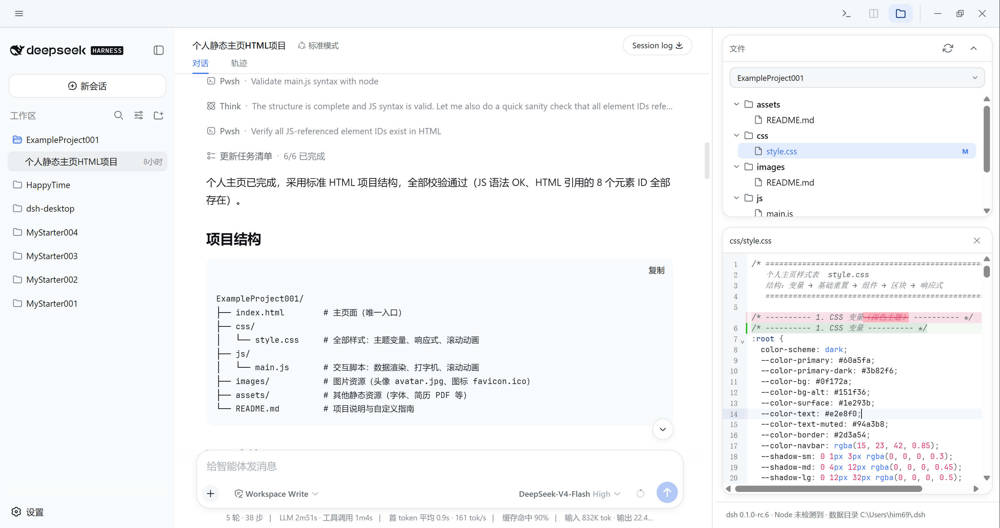

# DeepSeek Harness Desktop

**A real desktop app for [DeepSeek Harness](https://github.com/deepseek-ai/deepseek-harness)**

No more losing it in a sea of browser tabs — one icon, double-click to open, and it keeps
running quietly in the background when you close the window.

[中文](README.md) | English

**[⬇️ Download now](https://github.com/xiincs/deepseek-harness-desktop/releases/latest)** ·
[Features](#-what-it-does) ·
[FAQ](#-faq)

<!--
  Demo GIF placeholder: a 10-15s clip of "double-click the icon → window opens → open the
  file panel and preview/edit a file → close the window and bring it back from the tray"
  would replace the static screenshot below.
-->

---

## ✨ What is this

DeepSeek Harness ships as a web app — great on its own, but still just another browser tab:
easy to close by accident, easy to lose in a pile of other tabs, gone after a restart until you
dig it back up.

**DeepSeek Harness Desktop** turns it into an actual app: pin it to your taskbar or Dock like
any other program, double-click to open, and closing the window doesn't mean quitting — it sits
quietly in your system tray, one click away, exactly where you left it.

## 🚀 What it does

- **Double-click and go**: open the app and it gets everything running in the background for
  you — no terminal, no ports to figure out.
- **Closing isn't quitting**: hitting the close button just hides the window; work keeps going.
  Only "Quit" from the tray actually exits.
- **Same data as the web version**: sessions and settings live in one shared place — switch
  freely between the browser version and the desktop app with nothing to sync or lose.
- **File panel**: pop open a file tree on the side, click any file to preview, edit, and save it
  right there, changes highlighted inline — no more tabbing out to a separate editor.
- **Plugin market**: browse, search, and install community plugins from a growing, community-run
  catalog with hundreds of entries. Every install shows you the exact command it's about to run
  first; nothing installs silently on a single click.
- **Built-in terminal**: need to run a command? It's already in the app, no extra terminal
  window needed.
- **Recovers from crashes on its own**: if the background service dies unexpectedly, the app
  restarts it automatically; if that fails too, it tells you why instead of leaving you guessing.
- **Tells you about updates**: checks for a newer version on launch and installs it with one
  click — no need to go hunting on the releases page.
- **Small and fast**: uses your system's own browser engine instead of bundling a full Chromium
  like many similar apps do, so the installer is much smaller and it opens faster.

## ⬇️ Download

Head to the **[Releases page](https://github.com/xiincs/deepseek-harness-desktop/releases/latest)**
and grab the installer for your system:

| Platform | Installer | Notes |
|---|---|---|
| Windows | `.exe` | Signed, auto-updates, just double-click to install |
| macOS | `.dmg` | First launch needs a one-time manual allow in System Settings → Privacy & Security (expected — not enrolled in the Apple Developer program) |
| Linux | `.deb` | `dpkg -i` or open with your system's package installer |

> macOS and Linux builds don't auto-update yet — check back here for new versions.

  

## ❓ FAQ

**Is this an official product?**
No. DeepSeek Harness itself is maintained by the official team; this desktop wrapper is an
independent, community-built app that solves one specific problem — the web version being
inconvenient to live with day to day.

**Is my data safe?**
The web UI inside the app (the actual DeepSeek Harness part) runs in an isolated sandbox with
no access to anything on your computer, exactly like the browser version. The only thing that
does read and write local files is the desktop shell's own file panel — a separate, deliberately
added feature so you can edit files without leaving the app, fully isolated from the web UI.

**Can I use it offline?**
The app itself opens fine offline, but whether the DeepSeek Harness service inside it needs a
network connection depends entirely on how you've configured your model provider.

**Why doesn't the app track the newest pre-release version of dsh?**
On purpose: this app only follows upstream once a version is marked as the official default, not
just because a newer pre-release version number shows up. Some pre-releases get promoted a few
days later; others get quietly superseded by an even newer one and never promoted at all —
tracking them early would mean passing that uncertainty on to you.

**Want to contribute or build it yourself?**
Welcome — see the [development guide](docs/DEVELOPMENT.en.md).

## License

[MIT](./LICENSE)
</content>
